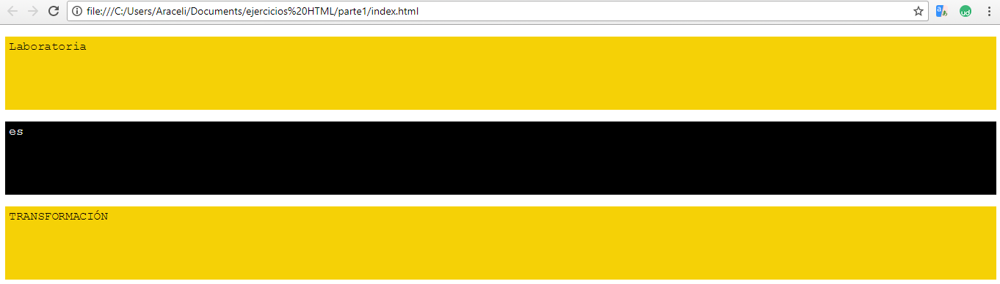

# Proyecto 1

## Objetivos

 El objetivo de este proyecto es aplicar os conocimientos sobre los elementos que componen el modelo de cajas aplicados para Box-Model, específicamente: content, padding,border y margin.

 ## Resultados

 
